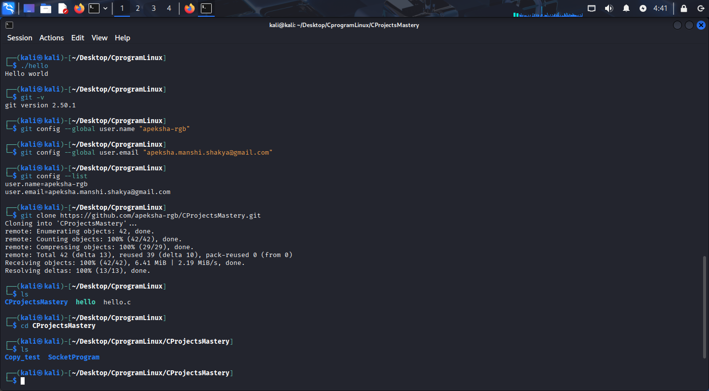

# **EXPLORE LINUX USING C**  

---

## **Workshop Brief**
This hands-on workshop introduces participants to Linux OS using C, covering real-world examples including:

- Bit-level data manipulation  
- File I/O performance  
- Memory management  
- TCP socket communication  

Participants will also learn to use **Git** for version control and work effectively in a Linux environment.

---

## **Project Directory Structure**

```bash

ExploreLinuxUsingC/
│
├── file_transfer/
│   ├── with_no_buff.c               // without buffer file copy
│   └── with_buff.c                  // Buffered file copy
│
├── packet_processing/
│   └── mpegts_header_ops.c          // MPEG-TS header operations (bitfields)
│
├── network_messaging/
│   └── tcp_messenger.c              // TCP chat/messaging application
│
└── memory_management/
└── memory_leak_demo.c           // Memory Leak

````

---

## **Prerequisites**

- **GCC compiler:** Check version  
```bash
  gcc --version
````

* **FTP tools:** FileZilla or other FTP (File Transfer Protocol) software
* **Basic Linux commands:** See the *Linux & Git Cheatsheet* section.

---

## **Accessing Files via Git**


> These commands work similarly in both Windows and Linux.

### **1. Set up Git username and email (one time per machine):**

```bash
git config --global user.name "Your Name"
git config --global user.email "youremail@example.com"
```

### **2. Clone the repository:**

```bash
git clone <repository-url>
```

### **3. Navigate into the project directory:**

```bash
cd ExploreLinuxUsingC
```

