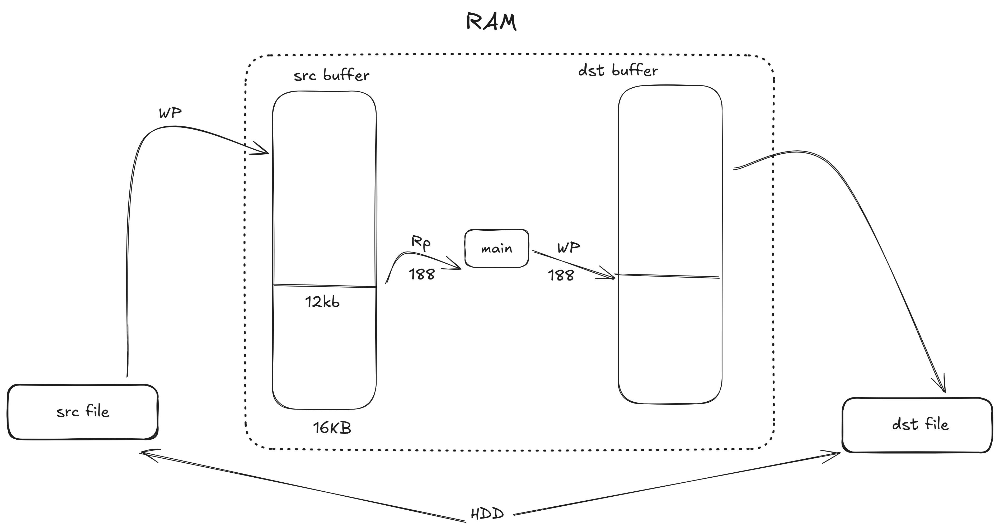

## **3. Program: File Transfer (Streaming)**  
### **File:** `file_transfer/with_no_buff.c`

---

### **Problem Statement**
When analyzing MPEG2TS headers, each packet is exactly **188 bytes**.  
We must read the file packet-by-packet and write the processed packets to another file.  
Copying large files in **188-byte chunks** brings performance and design challenges.

---

### **Implementation Brief**
- Reads and writes files in **188-byte chunks**.
- Uses a loop-based approach with `fread()` and `fwrite()`.
- Handles end-of-file conditions and **partial reads** safely.

---

---

## **3.1 Program: File Copy (Buffered)**  
### **File:** `file_transfer/with_buff.c`

---

### **Problem Statement**
Building on the previous challenge, this program optimizes file copy performance using **buffered I/O**.  
This reduces system calls and speeds up copying of large files.

---

### **Implementation Brief**
- Uses a **16 KB buffer** to reduce frequent read/write operations.
- Supports an optional `USE_BUFFERED_IO` compile-time flag for demonstration.
- Measures execution time using `clock_gettime()`.
- Proper memory allocation and deallocation ensures safety and performance.

---

## **Industry-Level Learnings & What This Code Teaches**

These file-copy programs showcase how **professional C code** handles file I/O, performance tuning, and robustness.

---

### **1. Chunked vs. Full-Memory I/O Strategies**
- Highlights the trade-off between **speed** and **memory footprint**.
- Real-world systems use buffered I/O to optimize throughput and avoid crashes.

---

### **2. Buffered I/O Design**
- Optional `USE_BUFFERED_IO` reveals performance differences.
- Internal buffering reduces **system calls**, improving overall speed.

---

### **3. High-Resolution Timing for Benchmarking**
- Uses `clock_gettime(CLOCK_MONOTONIC, ...)` for accurate profiling.
- Reinforces the principle:  
  **“Measure before you optimize.”**

---

### **4. Error Handling and Validation**
- Checks return values for:
  - `fopen()`
  - `malloc()`
  - `fread()`
  - `fwrite()`
- Demonstrates **defensive programming** and safe file handling.

---

### **5. Memory Management Discipline**
- Dynamically allocates buffers.
- Frees memory and avoids leaks, ensuring reliable large-file processing.

---

### **6. Scalable and Modular Design**
- Modular functions like:
  - `read_chunk()`
  - `write_chunk()`
  - `flush_write()`
- Clean structure improves maintainability and testing.

---

### **7. Performance Comparison & Testing**
- Shows how different I/O strategies behave under real workloads.
- Encourages **profiling-driven decisions**, a key industry practice.

---

### **8. Production Mindset**
- Handles:
  - Empty files
  - Read/write errors
  - Very large file sizes  
- Demonstrates how robust code anticipates real-world edge cases.

---

### **Overall Summary**
These programs teach how to write **maintainable, high-performance, and production-grade C code**, covering real-world concepts such as buffering, memory management, modularity, and defensive programming.

