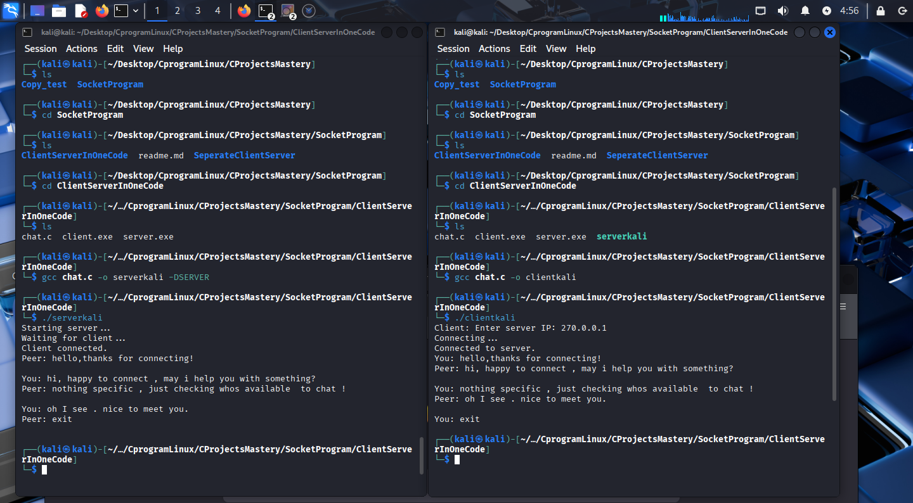

## **4. Program: Socket Programming**  
### **File:** `network_messaging/tcp_messenger.c`

---

### **Problem Statement**
This program enables **real-time communication** between a client and a server using **TCP sockets**.  
It demonstrates how two systems exchange messages interactively over a reliable network channel.

---

### **Implementation Brief**
- Server listens for incoming connections and **accepts a client**.
- Client connects to the **server’s IP and port**.
- Both endpoints support **interactive message exchange**.
- Gracefully exits communication when user sends `"exit"`.

---

## **Industry-Level Learning**

### **1. TCP fundamentals**
Demonstrates reliable, connection-oriented communication using TCP, the foundation of most internet applications.

---

### **2. Cross-platform handling**
Code structure works for both **Linux** and **Windows** (with minor header adjustments).

---

### **3. Interactive I/O**
Imitates real-world applications such as:
- Chat systems  
- Telemetry streams  
- Remote command tools  

---

### **4. Robust error handling**
Detects:
- Connection failures  
- Read/write errors  
- Unexpected client/server disconnects  

Ensures graceful recovery or shutdown.

---

### **5. Modular functions**
Functions like:
- `send_message()`
- `receive_message()`

improve readability, modularity, and real-world maintainability.

---

### **6. Production mindset**
Includes:
- Clean exit workflow  
- Input validation  
- Defensive error checking  
- Proper socket closing  

Reflects how messaging systems are built in professional environments.

---
